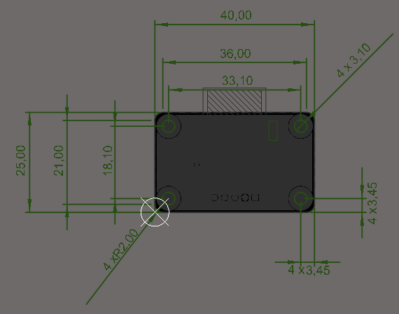

# 	Bluetooth Modülü

### 1. KAPSAM
Bu döküman Bluetooth Modülü'nün tanımını ve çalışma prensibini açıklar.


### 2. ÜRÜN PARAMETRELERİ
- 1 Çalışma Gerilimi: DC +3.3V 50 mA
- 2 Çalışma Frekansı: 2.4 GHz ISM Band
- 3 Çalışma Mesafesi: Açık alan için 100 metre
- 4 Çalışma Sıcaklığı: -5~ +65 °C 
- 5 Hız: Senkron 6KB- Asenkron 6KB

### 3. MEKANİK



Pdf [Bluetooth_Module](Mechanic/Bluetooth_Module.pdf)

### 4.PİN AÇIKLAMALARI
|Pin Adı| Açıklama|
|------|------|
|TX|Veri iletim hattı|
|RX|Veri alım hattı|
|NRst|Reset bağlantı pimi|
|GND|Toprak bağlantı pimi|
|3V3|+3.3V DC besleme pimi|

### 5. Arduino Bağlantısı 

-  NOT: Arduino pin çıkışları +5V seviyesinde olduğundan uzun süre kullanımlarda RX ve TX pinleri için gerilim bölücü kullanılmalı ve gerilim 3.3V DC'ye düşürülmelidir.

### 6. Devre


Data Sheet [HM11](https://wiki.seeedstudio.com/Bluetooth_V4.0_HM_11_BLE_Module/)

Sch File [Bluetooth_Module](Circuit/Bluetooth_Module.pdf) 

Bom List [BomList](Circuit/Bluetooth_Module_BomList.pdf) 

Gerber File [Gerber](Circuit/Bluetooth_Module_Gerber.zip) 

 ### GENEL BAKIŞ
 Bluetooth-Seri Modül Kartı, Bluetooth SSP(Serial Port Standart) ile kablosuz seri haberleşme uygulamaları için tasarlanmıştır. Prototiplemeye imkan sağlaması, breadboard, arduino ve çeşitli devrelerde rahatça kullanılabilmesi için gerekli pinler devre kartı sayesinde dışarıya alınmıştır.Standart pin yapısı sayesinde rahatça kontrol edilebilir. Jumper kablolar ile bağlantıları yapılabilir.Bluetooth 2.0'ı destekleyen bu kart, 2.4GHz frekansında haberleşme imkan sağlar.
 ### Arduino Örnek Kodu
 ```
 char veri;                           
int kirmiziPin = 9;                 
int sariPin = 10;                        
int maviPin = 11;                   
void setup() {
  Serial.begin(9600);              
  pinMode(kirmiziPin,OUTPUT);      
  pinMode(sariPin,OUTPUT);        
  pinMode(maviPin,OUTPUT);        
}
void loop() {
  if(Serial.available()>0){         
    veri = Serial.read();          
  }
  if(veri == 's'){                  
    digitalWrite(kirmiziPin,HIGH);   
    digitalWrite(sariPin,LOW);
    digitalWrite(maviPin,LOW);
    
  }
  else if(veri == 'y'){             
    digitalWrite(kirmiziPin,LOW);
    digitalWrite(sariPin,HIGH);
    digitalWrite(maviPin,LOW);
    
  }
  else if(veri == 'm'){             
    digitalWrite(kirmiziPin,LOW);
    digitalWrite(sariPin,LOW);
    digitalWrite(maviPin,HIGH);
   
  }
  else{                             
    digitalWrite(kirmiziPin,LOW);
    digitalWrite(sariPin,LOW);
    digitalWrite(maviPin,LOW);
  }
}
 
 
 
 ```

[Bluetooth Module](ArduionoExample/Bluettoth_Module/Bluettoth_Module.ino)
